# 
**Assembly Line**
      

An assembly line is a process used in factories to make products efficiently. Imagine a conveyor belt that moves along, and different workers stand alongside it. Each worker has a specific job to do, and as the product moves along the belt, each worker adds or modifies a part of it.

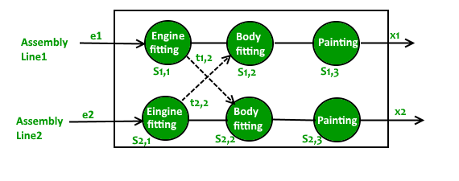    

 Let's take the example of making a car. At the beginning of the assembly line, workers may attach the frame and wheels to create the basic structure. Then, as the car moves forward, other workers might add the engine, seats, and other parts. Each worker focuses on a particular task and repeats it for every car that comes their way.

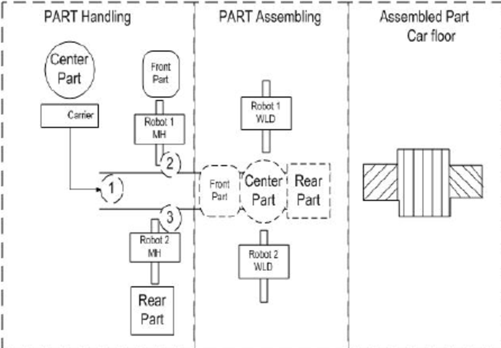     

The idea is that by dividing  the production process into smaller tasks and having specialised workers for each task, the work becomes more efficient. Each worker becomes skilled at their specific job, and because they only do that one task repeatedly, they can do it faster and better. 

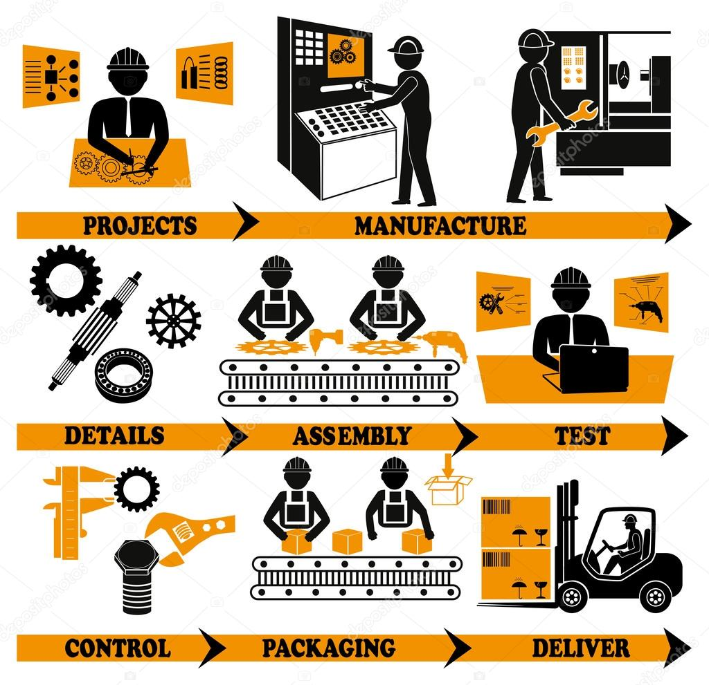      

The assembly line helps to save time and increase productivity. By continuously moving the products from one worker to another, the overall production speed can be much higher than if each worker had to build the entire product on their own.

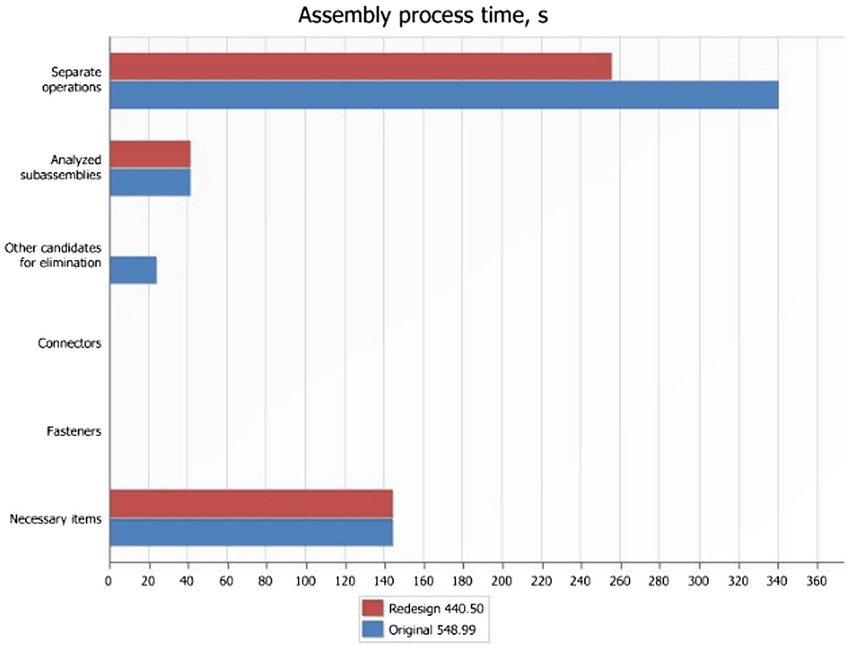     

So, in simple terms, an assembly line is like a team of workers standing beside a moving conveyor belt, each doing a specific task to build a product, which moves along the line as it is being built.

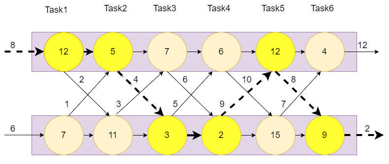   

# 
 **Advantage and Disadvantage of Assembly Line**

## 
 **Advantages of Assembly Line** 
    

**
  Increased Efficiency**  

Assembly lines allow products to be made quickly and efficiently. Each worker performs a specific task, which helps to streamline the production process and minimise wasted time.      

     

**
Higher Productivity**   

By dividing the manufacturing process into smaller tasks, assembly lines enable workers to specialise in their respective tasks. This specialisation leads to increased productivity as workers become more skilled and efficient in their specific area.      

      

**
 Cost-Effective **   

Assembly lines often result in lower production costs. The efficient workflow and increased productivity help to reduce labour and manufacturing expenses, making the overall production process more cost-effective.       

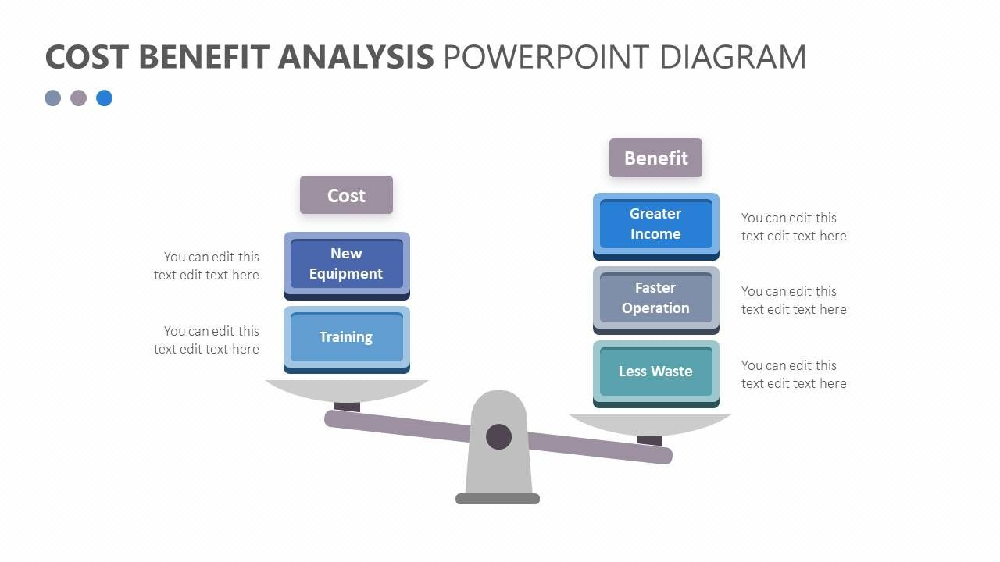       

**
Consistent Quality**  

Assembly lines ensure consistent quality by setting specific standards for each task. Workers are trained to perform their assigned tasks with precision, resulting in standardised and reliable products.          

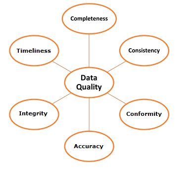       

**
Faster Production **  

With the division of labour, assembly lines enable products to be manufactured at a faster rate. The continuous flow of work and the elimination of downtime between tasks contribute to faster production times.     

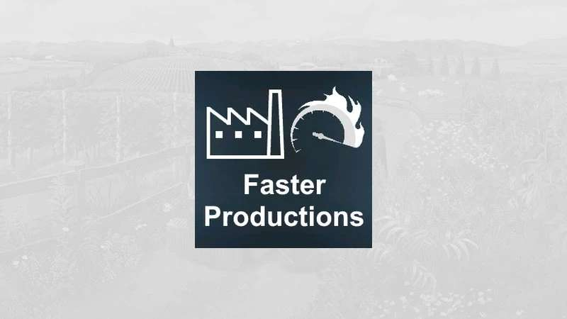      

## 
**Disadvantages of Assembly Line**

**
Monotonous Work **

Assembly line jobs typically involve repetitive tasks, which can become monotonous and tedious over time. This can lead to decreased job satisfaction and potentially affect the motivation and well-being of workers.     

       

**
Limited Flexibility**  

Assembly lines are designed to produce a specific product or a limited range of products. If there is a need to switch to a different product or make significant changes to the production process, it can be challenging to adapt the assembly line quickly.    

       

**
Dependency on Equipment**

Assembly lines heavily rely on machinery and equipment. If there is a breakdown or malfunction in any part of the assembly line, it can disrupt the entire production process and cause delays until the issue is resolved.       

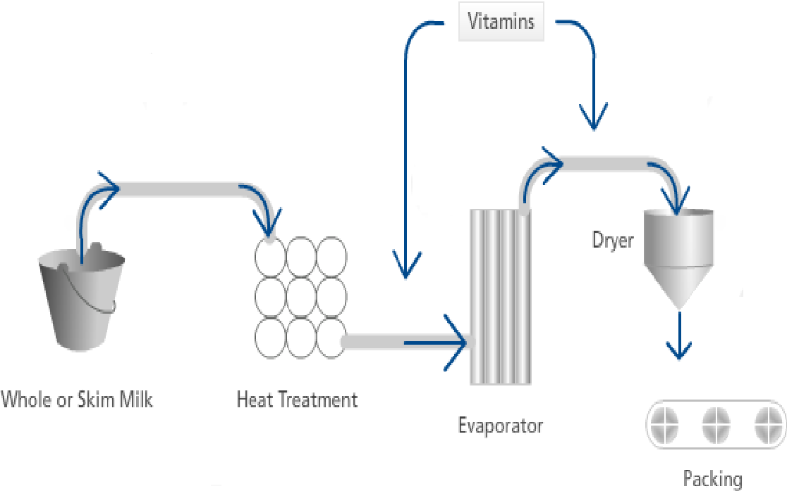      

**
Workforce Specialisation**

While specialisation enhances productivity, it can also limit the versatility of the workforce. Workers may become highly skilled in one particular task but lack the ability to perform other tasks, which can hinder their career development and job opportunities.    

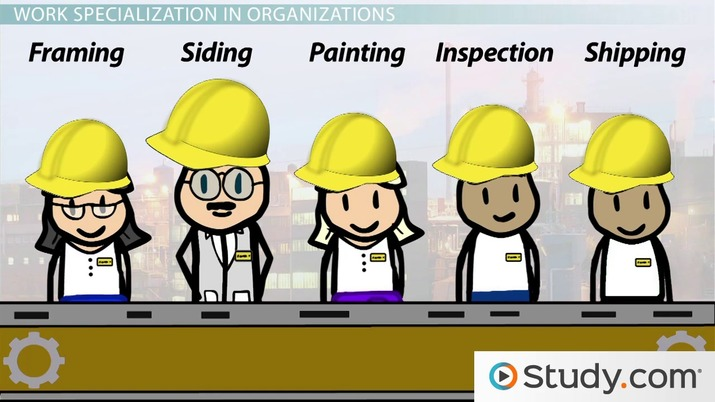         

**
Reduced Worker Autonomy**

Assembly line work often involves strict adherence to set procedures and limited decision-making authority. Workers may have little control over their tasks or the overall production process, leading to a lack of autonomy and creativity in their work.      

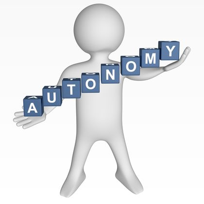       

# 
**Conclusion** 
  

Overall, assembly lines have had a profound impact on the manufacturing industry, making production faster, more efficient, and cost-effective, while also maintaining product quality.
    

